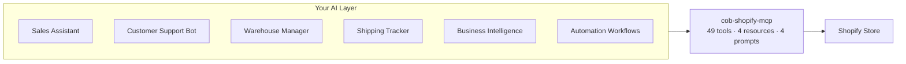
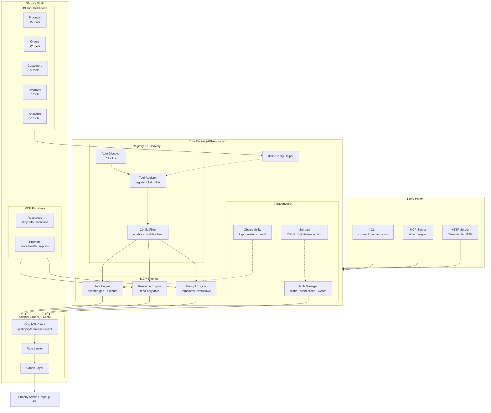

# cob-shopify-mcp

Production-grade MCP server **and** CLI tool for Shopify. Use it as an MCP server for AI agents (Claude, Cursor, Windsurf) or as a standalone CLI to manage Shopify stores directly from your terminal — no MCP required.

## Features

- **49 built-in tools + 5 example custom tools** across 5 domains (Products, Orders, Customers, Inventory, Analytics)
- **Standalone CLI** — manage your store from the terminal without MCP (`cob-shopify-mcp tools list`, `stores list`, etc.)
- **MCP server** — connect to Claude, Cursor, Windsurf, or any MCP-compatible AI agent
- **4 MCP resources** (Shop info, Locations, Policies, Currencies)
- **4 MCP prompts** (Health check, Sales report, Inventory risk, Support summary)
- **Dual transport** — stdio (default) + Streamable HTTP
- **3 auth methods** — Static token, OAuth client credentials, OAuth authorization code
- **Cost tracking** — Every response includes Shopify API cost metadata
- **Rate limiting** — Respects Shopify's cost-based throttling
- **Query caching** — Configurable TTL per query type
- **Config-driven** — YAML config, env vars, CLI overrides
- **Type-safe** — Full TypeScript with Zod validation

## Use Cases



| Role | What it does | Tools used |
|------|-------------|------------|
| **Sales Assistant** | Answer product questions, check inventory, create draft orders, look up customer history and lifetime value | `search_products`, `get_product`, `list_inventory_levels`, `create_draft_order`, `get_customer_lifetime_value` |
| **Customer Support Bot** | Look up orders by name/number, track fulfillment, view timeline, pull customer details | `get_order_by_name`, `get_order_fulfillment_status`, `get_order_timeline`, `get_customer`, `get_customer_orders` |
| **Warehouse Manager** | Monitor stock levels, get low-stock alerts, adjust inventory, check location inventory | `low_stock_report`, `list_inventory_levels`, `adjust_inventory`, `set_inventory_level`, `get_location_inventory` |
| **Shipping Executive** | Track fulfillment status, view order details, update order notes/tags | `get_order_fulfillment_status`, `list_orders`, `add_order_note`, `update_order_tags` |
| **Business Intelligence** | Sales summaries, top products, refund rates, repeat customer analysis, inventory risk | `sales_summary`, `top_products`, `refund_rate_summary`, `repeat_customer_rate`, `inventory_risk_report` |
| **Automation Pipeline** | Bulk product updates, tag management, order processing, customer segmentation | `update_product`, `manage_product_tags`, `add_order_tag`, `add_customer_tag`, `create_product` |

### Integration Patterns

**1. Direct MCP (simplest)** — Claude, Cursor, or any MCP client connects directly:
```
AI Agent → MCP Protocol → cob-shopify-mcp → Shopify API
```

**2. Agent Orchestration Layer** — Your custom agent framework uses MCP as the Shopify bridge:
```
User → Your App → Agent Layer (LangChain, CrewAI, etc.) → MCP Client → cob-shopify-mcp → Shopify API
```

**3. RAG + MCP** — Combine retrieval-augmented generation with live Shopify data:
```
User → Your App → RAG (product docs, policies, FAQs) + MCP (live store data) → Response
```

**4. Multi-Agent System** — Multiple specialized agents share one MCP server:
```
Sales Agent    ─┐
Support Agent  ─┤→ cob-shopify-mcp (HTTP transport) → Shopify API
Warehouse Agent─┘
```

## Quick Start

> **First:** Complete [Getting Shopify Credentials](#getting-shopify-credentials) below to get your Client ID, Client Secret, and store domain. Then come back here.

Pick one of the three paths below. All get you to the same result — a working MCP server connected to Claude.

---

### Path A: npm install (simplest — no clone, no build)

Install globally and connect in two commands. No `.env` file needed — credentials go straight into the Claude config.

```bash
npm install -g cob-shopify-mcp
```

**Connect to Claude CLI:**

```bash
claude mcp add shopify \
  -e SHOPIFY_CLIENT_ID=your_client_id \
  -e SHOPIFY_CLIENT_SECRET=shpss_your_secret \
  -e SHOPIFY_STORE_DOMAIN=your-store.myshopify.com \
  -- cob-shopify-mcp start
```

Done. Claude launches the server automatically when needed. Verify:

```bash
claude mcp list
# shopify: ... - ✓ Connected
```

**Or with npx (no install at all):**

```bash
claude mcp add shopify \
  -e SHOPIFY_CLIENT_ID=your_client_id \
  -e SHOPIFY_CLIENT_SECRET=shpss_your_secret \
  -e SHOPIFY_STORE_DOMAIN=your-store.myshopify.com \
  -- npx cob-shopify-mcp start
```

**Or connect to Claude Desktop** — add to `claude_desktop_config.json` ([file location](#claude-desktop-config-location)):

```json
{
  "mcpServers": {
    "shopify": {
      "command": "cob-shopify-mcp",
      "args": ["start"],
      "env": {
        "SHOPIFY_CLIENT_ID": "your_client_id",
        "SHOPIFY_CLIENT_SECRET": "shpss_your_secret",
        "SHOPIFY_STORE_DOMAIN": "your-store.myshopify.com"
      }
    }
  }
}
```

Restart Claude Desktop after saving. You'll see the tools icon showing 49 available tools.

---

### Path B: Clone and build (for development / contributing)

Clone the repo and build from source. Claude launches the server via **stdio** — you don't run it yourself.

**B1. Clone and build:**

```bash
git clone https://github.com/svinpeace/cob-shopify-mcp.git
cd cob-shopify-mcp
pnpm install
pnpm build
```

**B2. Connect to Claude CLI:**

```bash
claude mcp add shopify \
  -e SHOPIFY_CLIENT_ID=your_client_id \
  -e SHOPIFY_CLIENT_SECRET=shpss_your_secret \
  -e SHOPIFY_STORE_DOMAIN=your-store.myshopify.com \
  -- node /absolute/path/to/cob-shopify-mcp/dist/cli/index.js start
```

Done. Verify:

```bash
claude mcp list
# shopify: ... - ✓ Connected
```

**Or connect to Claude Desktop** — add to `claude_desktop_config.json` ([file location](#claude-desktop-config-location)):

```json
{
  "mcpServers": {
    "shopify": {
      "command": "node",
      "args": ["/absolute/path/to/cob-shopify-mcp/dist/cli/index.js", "start"],
      "env": {
        "SHOPIFY_CLIENT_ID": "your_client_id",
        "SHOPIFY_CLIENT_SECRET": "shpss_your_secret",
        "SHOPIFY_STORE_DOMAIN": "your-store.myshopify.com"
      }
    }
  }
}
```

---

### Path C: Docker (long-running HTTP server)

Run the server as a container via **HTTP** transport. Good for always-on setups, VPS deployments, or shared team access.

**C1. Clone and configure:**

```bash
git clone https://github.com/svinpeace/cob-shopify-mcp.git
cd cob-shopify-mcp
cp .env.example .env
```

Edit `.env` with your credentials:

```env
SHOPIFY_CLIENT_ID=your_client_id
SHOPIFY_CLIENT_SECRET=shpss_your_secret
SHOPIFY_STORE_DOMAIN=your-store.myshopify.com
```

**C2. Build and start the container:**

```bash
docker compose up --build
# Server starts at http://127.0.0.1:3000
```

Verify it's running:

```bash
curl http://127.0.0.1:3000/health
# {"status":"ok"}
```

**C3. Connect to Claude CLI:**

```bash
claude mcp add --transport http shopify http://127.0.0.1:3000

# Verify
claude mcp list
# shopify: http://127.0.0.1:3000 (HTTP) - ✓ Connected
```

**Or connect to Claude Desktop** — add to `claude_desktop_config.json` ([file location](#claude-desktop-config-location)):

```json
{
  "mcpServers": {
    "shopify": {
      "url": "http://127.0.0.1:3000"
    }
  }
}
```

> **Windows note:** Use `127.0.0.1` not `localhost` — Docker on Windows may not bind to IPv6 `::1` which `localhost` can resolve to.

---

<a id="claude-desktop-config-location"></a>

**Claude Desktop config file location:**

| OS | Path |
|----|------|
| macOS | `~/Library/Application Support/Claude/claude_desktop_config.json` |
| Windows | `%APPDATA%\Claude\claude_desktop_config.json` |

## Getting Shopify Credentials

Everything happens through the **Shopify Developer Dashboard** at [dev.shopify.com](https://dev.shopify.com). You need two things: a **dev store** (free) and an **app** with the right scopes.

### Step 1 — Sign in to the Developer Dashboard

1. Go to [dev.shopify.com](https://dev.shopify.com)
2. Sign in with your Shopify account (or create one — it's free, no credit card needed)
3. You'll land on the Developer Dashboard with **Apps**, **Dev stores**, and **Catalogs** in the left sidebar

### Step 2 — Create a development store

You need a store to test against. Dev stores are free and never expire.

1. Click **Dev stores** in the left sidebar
2. Click **Create store**
3. Fill in the store name (e.g., `my-dev-store`) — this becomes `my-dev-store.myshopify.com`
4. Complete the setup

> Note your store domain — you'll need it: `my-dev-store.myshopify.com`

### Step 3 — Create an app and configure scopes

1. Click **Apps** in the left sidebar
2. Click **Create app** (top-right)
3. Enter an app name (e.g., `Shopify MCP Server`) and click **Next**
4. You'll land on the **version configuration** page

5. Scroll down to the **Access** section
6. Click **Select scopes** — this opens a dropdown where you can either:
   - **Search and check** each scope individually, or
   - **Paste** a comma-separated list directly into the field

**Full access (recommended — copy-paste this entire block):**

```
read_products, write_products, read_orders, write_orders, read_all_orders, read_draft_orders, write_draft_orders, read_order_edits, write_order_edits, read_customers, write_customers, read_inventory, write_inventory, read_locations, read_fulfillments, write_fulfillments, read_assigned_fulfillment_orders, write_assigned_fulfillment_orders, read_merchant_managed_fulfillment_orders, write_merchant_managed_fulfillment_orders, read_third_party_fulfillment_orders, write_third_party_fulfillment_orders, read_shipping, read_reports, read_legal_policies
```

> **Read-only?** Use only the read scopes and set `COB_SHOPIFY_READ_ONLY=true` in `.env`:
> ```
> read_products, read_orders, read_all_orders, read_draft_orders, read_customers, read_inventory, read_locations, read_fulfillments, read_assigned_fulfillment_orders, read_merchant_managed_fulfillment_orders, read_third_party_fulfillment_orders, read_shipping, read_reports, read_legal_policies
> ```

What each scope enables:

| Scope | What it covers |
|-------|---------------|
| **Products** | |
| `read_products` | List, search, get products, variants, collections, tags |
| `write_products` | Create/update/delete products, variants, tags, status, collections |
| **Orders** | |
| `read_orders` | List, search, get orders (last 60 days), timeline, analytics |
| `read_all_orders` | Read orders older than 60 days (historical data — requires approval) |
| `write_orders` | Update order notes/tags, mark paid, cancel orders |
| `read_draft_orders` | List, get draft orders |
| `write_draft_orders` | Create draft orders, complete draft orders to real orders |
| `read_order_edits` | View order modification history |
| `write_order_edits` | Edit existing orders (add/remove items, adjust prices) |
| **Customers** | |
| `read_customers` | List, search, get customers, lifetime value, order history |
| `write_customers` | Create/update customers, manage tags |
| **Inventory** | |
| `read_inventory` | Inventory levels, items, SKU lookup, low stock reports |
| `write_inventory` | Adjust quantities, set inventory levels |
| `read_locations` | Store locations (required by inventory tools) |
| **Fulfillment** | |
| `read_fulfillments` | Read fulfillment data and services |
| `write_fulfillments` | Create/modify fulfillment services |
| `read_assigned_fulfillment_orders` | Read fulfillment orders assigned to your app |
| `write_assigned_fulfillment_orders` | Create fulfillments, update tracking for assigned orders |
| `read_merchant_managed_fulfillment_orders` | Read merchant-managed fulfillment orders |
| `write_merchant_managed_fulfillment_orders` | Fulfill and track merchant-managed orders |
| `read_third_party_fulfillment_orders` | Read 3PL fulfillment orders |
| `write_third_party_fulfillment_orders` | Fulfill and track 3PL orders |
| **Other** | |
| `read_shipping` | Shipping zones, rates, and delivery carrier services |
| `read_reports` | Store reports and analytics data |
| `read_legal_policies` | Store policies (used by shop-policies MCP resource) |

> For even more scopes (themes, discounts, metafields, gift cards, marketing, returns, etc.) for custom YAML tools, see the **[Custom Tools Guide](custom-tools/README.md#scopes-reference)**.

7. Click **Release** (top-right) to create the app version with these scopes

### Step 4 — Get your Client ID and Client Secret

1. Click **Settings** in the left sidebar
2. Under **Credentials**, copy the **Client ID** (a 32-character hex string)
3. Click the reveal icon next to **Secret** and copy it (starts with `shpss_`)

### Step 5 — Install the app on your dev store

1. Click **Overview** in the left sidebar (or your app name at the top)
2. Under **Installs**, click **Install app**
3. Select your development store and approve the permissions

### Step 6 — Configure `.env`

```bash
cp .env.example .env
```

Fill in your credentials:

```env
SHOPIFY_CLIENT_ID=your_client_id_here
SHOPIFY_CLIENT_SECRET=shpss_your_secret_here
SHOPIFY_STORE_DOMAIN=my-dev-store.myshopify.com
SHOPIFY_API_VERSION=2025-01
```

The server uses **client credentials auth** — it automatically exchanges your Client ID + Secret for a 24-hour access token, and refreshes it before it expires. No manual token management needed.

> **Alternative: Static access token.** If you already have a `shpat_` token (from Shopify CLI, a custom app, or another source), you can use that instead:
> ```env
> SHOPIFY_ACCESS_TOKEN=shpat_xxxxxxxxxxxxxxxxxxxxxxxxxxxxxxxx
> SHOPIFY_STORE_DOMAIN=my-dev-store.myshopify.com
> ```
> When `SHOPIFY_ACCESS_TOKEN` is set, the server uses it directly and ignores Client ID/Secret.

Done. Proceed to [Quick Start](#quick-start) to run the server.

## Configuration

### Config File

Create `cob-shopify-mcp.config.yaml` in your project root:

```yaml
auth:
  method: token                    # token | client-credentials | authorization-code
  store_domain: ${SHOPIFY_STORE_DOMAIN}
  access_token: ${SHOPIFY_ACCESS_TOKEN}

shopify:
  api_version: "2026-01"
  cache:
    read_ttl: 30                   # seconds
    search_ttl: 10
    analytics_ttl: 300

tools:
  read_only: false                 # disable all mutations
  disable: []                      # tool names to disable
  enable: []                       # tool names to force-enable (even tier 2)

transport:
  type: stdio                      # stdio | http
  port: 3000
  host: "0.0.0.0"

storage:
  backend: json                    # json | sqlite
  path: "~/.cob-shopify-mcp/"

observability:
  log_level: info                  # debug | info | warn | error
  audit_log: true

rate_limit:
  respect_shopify_cost: true
  max_concurrent: 10
```

### Environment Variables

| Variable | Maps To |
|----------|---------|
| `SHOPIFY_ACCESS_TOKEN` | `auth.access_token` |
| `SHOPIFY_STORE_DOMAIN` | `auth.store_domain` |
| `SHOPIFY_CLIENT_ID` | `auth.client_id` |
| `SHOPIFY_CLIENT_SECRET` | `auth.client_secret` |
| `SHOPIFY_API_VERSION` | `shopify.api_version` |
| `COB_SHOPIFY_READ_ONLY` | `tools.read_only` |
| `COB_SHOPIFY_LOG_LEVEL` | `observability.log_level` |

### Config Precedence

`defaults < config file < environment variables < CLI flags`

## CLI Commands

```bash
cob-shopify-mcp start              # Start the MCP server
cob-shopify-mcp start --transport http --port 8080
cob-shopify-mcp start --read-only  # Disable all mutations

cob-shopify-mcp connect --store my-store.myshopify.com  # OAuth flow

cob-shopify-mcp config show        # Show resolved config (secrets masked)
cob-shopify-mcp config validate    # Validate config
cob-shopify-mcp config init        # Generate starter config file

cob-shopify-mcp tools list         # List all tools with status
cob-shopify-mcp tools list --domain products
cob-shopify-mcp tools list --tier 1
cob-shopify-mcp tools info list_products  # Show tool details

cob-shopify-mcp stores list        # List connected stores
cob-shopify-mcp stores remove my-store.myshopify.com
```

## Tools Reference

### Products (15 tools)
| Tool | Description | Scope |
|------|-------------|-------|
| `list_products` | List products with filters | `read_products` |
| `get_product` | Get product by ID | `read_products` |
| `get_product_by_handle` | Get product by URL handle | `read_products` |
| `search_products` | Full-text product search | `read_products` |
| `list_product_variants` | List variants for a product | `read_products` |
| `get_product_variant` | Get variant by ID | `read_products` |
| `list_collections` | List collections | `read_products` |
| `get_collection` | Get collection by ID | `read_products` |
| `create_product` | Create a new product | `write_products` |
| `create_product_variant` | Add variant to product | `write_products` |
| `create_collection` | Create a collection | `write_products` |
| `update_product` | Update product fields | `write_products` |
| `update_product_variant` | Update variant fields | `write_products` |
| `update_product_status` | Change product status | `write_products` |
| `manage_product_tags` | Add/remove product tags | `write_products` |

### Orders (12 tools)
| Tool | Description | Scope |
|------|-------------|-------|
| `list_orders` | List orders with filters | `read_orders` |
| `search_orders` | Search orders by query | `read_orders` |
| `get_order` | Get order by ID | `read_orders` |
| `get_order_by_name` | Get order by name (#1001) | `read_orders` |
| `get_order_timeline` | Get order events timeline | `read_orders` |
| `get_order_fulfillment_status` | Get fulfillment details | `read_orders` |
| `create_draft_order` | Create a draft order | `write_draft_orders` |
| `add_order_note` | Add note to order | `write_orders` |
| `update_order_note` | Update order note | `write_orders` |
| `add_order_tag` | Add tags to order | `write_orders` |
| `update_order_tags` | Update order tags | `write_orders` |
| `mark_order_paid` | Mark order as paid | `write_orders` |

### Customers (9 tools)
| Tool | Description | Scope |
|------|-------------|-------|
| `list_customers` | List customers | `read_customers` |
| `search_customers` | Search customers | `read_customers` |
| `get_customer` | Get customer by ID | `read_customers` |
| `get_customer_orders` | Get customer's orders | `read_customers` |
| `get_customer_lifetime_value` | Get customer LTV | `read_customers` |
| `create_customer` | Create a customer | `write_customers` |
| `update_customer` | Update customer fields | `write_customers` |
| `add_customer_tag` | Add tags to customer | `write_customers` |
| `remove_customer_tag` | Remove tags from customer | `write_customers` |

### Inventory (7 tools)
| Tool | Description | Scope |
|------|-------------|-------|
| `get_inventory_item` | Get inventory item by ID | `read_inventory` |
| `get_inventory_by_sku` | Get inventory by SKU | `read_inventory` |
| `list_inventory_levels` | List inventory levels | `read_inventory`, `read_locations` |
| `get_location_inventory` | Get inventory at location | `read_inventory`, `read_locations` |
| `low_stock_report` | Low stock items report | `read_inventory`, `read_locations` |
| `adjust_inventory` | Adjust inventory quantity | `write_inventory` |
| `set_inventory_level` | Set inventory level | `write_inventory` |

### Analytics (6 tools)
| Tool | Description | Scope |
|------|-------------|-------|
| `sales_summary` | Sales totals for period | `read_orders` |
| `top_products` | Top products by revenue | `read_orders`, `read_products` |
| `orders_by_date_range` | Orders grouped by period | `read_orders` |
| `refund_rate_summary` | Refund rate analysis | `read_orders` |
| `repeat_customer_rate` | Repeat customer analysis | `read_orders`, `read_customers` |
| `inventory_risk_report` | Inventory risk assessment | `read_inventory`, `read_products` |

## Other Editors (Cursor / Windsurf)

Add to `.cursor/mcp.json` or equivalent:

```json
{
  "mcpServers": {
    "shopify": {
      "command": "npx",
      "args": ["-y", "cob-shopify-mcp", "start"],
      "env": {
        "SHOPIFY_CLIENT_ID": "your_client_id",
        "SHOPIFY_CLIENT_SECRET": "shpss_your_secret",
        "SHOPIFY_STORE_DOMAIN": "your-store.myshopify.com"
      }
    }
  }
}
```

## Development

```bash
pnpm install
pnpm test           # Unit tests
pnpm test:integration  # Integration tests (requires Shopify credentials)
pnpm lint           # Biome linter
pnpm typecheck      # TypeScript type checking
pnpm build          # Build with tsup
```

## Architecture

<div align="center">

[](https://svinpeace.github.io/cob-shopify-mcp/assets/architecture.html)

*Animated, interactive diagram showing how Entry Points, Core Engine, Shopify Shell, and the GraphQL API connect*

</div>



### Project Structure

```
src/
├── core/               # API-agnostic MCP server core
│   ├── config/         # Zod config schema, multi-source loader
│   ├── auth/           # Static token, client credentials, OAuth
│   ├── engine/         # Tool, Resource, Prompt execution engines
│   ├── registry/       # Tool registry with config filtering
│   ├── storage/        # JSON + SQLite backends with encryption
│   ├── transport/      # stdio + HTTP transports
│   ├── observability/  # pino logger, cost tracker, audit log
│   └── helpers/        # defineTool, defineResource, definePrompt
├── shopify/            # Shopify-specific implementation
│   ├── client/         # GraphQL client, rate limiter, cache, retry
│   ├── tools/          # 49 tools across 5 domains
│   ├── resources/      # 4 MCP resources
│   └── prompts/        # 4 MCP prompts
├── server/             # Server bootstrap and registration bridges
└── cli/                # CLI commands (citty + consola)
```

## How It Compares

49 tools ship enabled out of the box — but the tool count is **unlimited**. Developers can add any Shopify GraphQL operation as a custom tool using simple YAML files, no TypeScript required:

```yaml
# my-tools/get-metafields.yaml
name: get_shop_metafields
domain: shop
description: Get shop metafields by namespace
scopes: [read_metafields]
input:
  namespace:
    type: string
    description: Metafield namespace
    required: true
graphql: |
  query($namespace: String!) {
    shop {
      metafields(first: 10, namespace: $namespace) {
        edges { node { key value } }
      }
    }
  }
response:
  mapping: shop.metafields.edges
```

Point your config at the directory and they're live:

```yaml
tools:
  custom_paths: ["./my-tools/"]
```

The **3-tier system** gives full control: Tier 1 (enabled by default), Tier 2 (disabled by default, opt-in via config), Tier 3 (custom YAML tools, enabled by default). Plus `tools.enable` / `tools.disable` for granular overrides.

See the **[Custom Tools Guide](custom-tools/README.md)** for the full reference — YAML structure, variable naming rules, response mapping, scopes reference, error handling, and step-by-step examples.

The package ships with **5 ready-to-use custom tools** in `custom-tools/` — draft order completion, fulfillment orders, create fulfillment with tracking, update tracking, and order cancellation. They're enabled by default in `.env.example` (`COB_SHOPIFY_CUSTOM_TOOLS=./custom-tools`). To disable them, remove or comment out that line.

### Managing Tools

```bash
# Via environment variables
COB_SHOPIFY_CUSTOM_TOOLS=./custom-tools    # Load custom YAML tools from directory
COB_SHOPIFY_DISABLE=cancel_order,tool2     # Disable specific tools
COB_SHOPIFY_ENABLE=some_tier2_tool         # Enable specific Tier 2 tools
COB_SHOPIFY_READ_ONLY=true                 # Disable ALL write operations
```

| Feature | **cob-shopify-mcp** | GeLi2001 (147⭐) | pashpashpash (35⭐) | antoineschaller (10⭐) | benwmerritt |
|---------|:---:|:---:|:---:|:---:|:---:|
| **Tools** | **54** (49 built-in + 5 custom) | 14 | 15 | 22 | 30+ |
| **MCP Resources** | **4** | 0 | 0 | 0 | 0 |
| **MCP Prompts** | **4** | 0 | 0 | 0 | 0 |
| **Auth methods** | **3** (static, client-creds, OAuth) | 2 | 1 | 1 | 2 |
| **HTTP Transport** | **Streamable HTTP** | No | No | No | No |
| **Encrypted Storage** | **JSON + SQLite** | No | No | No | No |
| **Unit Tests** | **397** | ~2 | minimal | 1 | ~2 |
| **Docker** | **Multi-stage** | No | No | No | No |
| **Rate Limiter** | **Yes** | No | No | No | No |
| **Query Cache** | **Yes** | No | No | No | No |
| **Observability** | **pino + audit + cost** | No | No | No | No |
| **Config-driven** | **Tier system + YAML** | No | No | No | No |

## Ecosystem

This server manages your store via the **Admin GraphQL API**. Pair it with Shopify's official MCP servers for the complete experience:

| Server | Purpose | Complements cob-shopify-mcp |
|--------|---------|----------------------------|
| [`@shopify/dev-mcp`](https://www.npmjs.com/package/@shopify/dev-mcp) | Search Shopify docs, introspect Admin GraphQL schema | Learn the API while this server manages your store |
| [Storefront MCP](https://shopify.dev/docs/apps/build/storefront-mcp) | Product browsing, cart, checkout (built into every store) | Customer-facing shopping vs admin-side management |

## License

MIT
